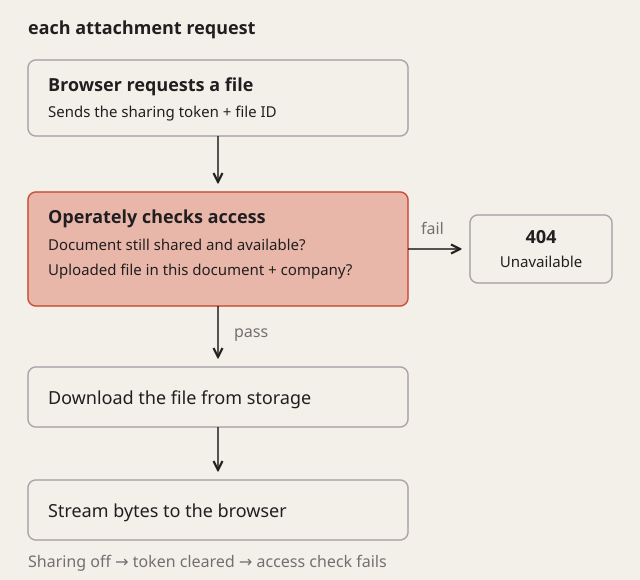

I recently added [public document sharing to Operately](https://github.com/operately/operately/pull/5351), so you can send someone a document without inviting them into your company’s workspace. The link gives them a read-only view, including attachments. You can disable it afterward, which gets a little more involved when the document contains files stored elsewhere.

For an embedded image, we could give the browser a temporary URL from storage. That URL would keep working until it expired, even after someone turned document sharing off. Anyone who had saved the image’s address could continue fetching it directly. To make the sharing control apply to those requests too, I had to keep the document’s access check in the path to the file.

In the PR, I routed those requests through `/public/documents/:token/blobs/:id`, so the document’s sharing token travels with each attachment request. Before sending the bytes, Operately uses the token to find a document that’s still available to share. The file also has to belong to the same company and appear in the document’s current content. We pay for that choice by handling attachment traffic in the application, including downloading each file from storage before serving it.

Once an editor disables sharing, the token is cleared and requests through those addresses fail. Turning sharing back on creates a new token, so links sent out earlier stay broken. Someone who downloaded a copy already has the file, of course. What we control is whether our server serves it again.

Removing an image from a shared document cuts off access through its old address too, because each request checks the current content, including edits made since someone first opened the page. A reader could still have that address open in another tab. The server returns 404 when they request it again, even if sharing remains enabled for the document.
